# [NewsTUBE]() - Recevez automatiquement un résumé quotidien des publications de vos chaines Youtube préférées par email.

Ce projet est une expérimentation fonctionnelle permettant d'utiliser quelques process d'automatisation couplés avec de l'IA. Vu qu'il s'agit d'un Proof of Concept, les PR et ISSUES ne seront pas traités.
Il est utilisé pour générér une newsletter et l'envoyer par email, mais il pourrait tout aussi bien envoyer une notification sur SLACK, TELEGRAM, WHATSAPP ...

**Le chunck des inputs n'est pas géré, des textes de plus de 4000 tokens peuvent provoquer des erreurs en fonction du type de modèle LLM choisi (GPT 3.5 = 4k tokens)**

Les compétences techniques à connaitre pour déployer cette application sont énumérées ci-dessous. Celles-ci ne feront pas l'objet d'explications au sein de ce README.

- savoir utiliser docker / docker-compose
- savoir créer une clé API sur OPENAI
- savoir créer un projet API et Services sur GOOGLE CLOUD PLATFORM et y associer YOUTUBE et GMAIL
- savoir utiliser LINUX UBUNTU
- savoir trouver l'ID d'une chaine Youtube
- connaite le HTML et le CSS pour la personnalisation de la newsletter

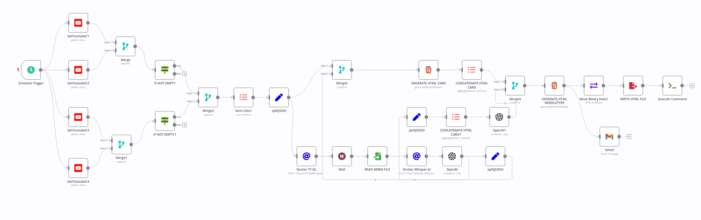

## Description

4 composants principaux :

- [N8N](https://github.com/n8n-io/n8n) (alternative opensource à zapier)
- [YOUTUBE-DL](https://github.com/nbr23/youtube-dl-server) (application opensource permettant de récupérer des vidéos et de les convertir en différents formats)
- [WHISPER AI](https://github.com/ahmetoner/whisper-asr-webservice) (application opensource permettant de transcrire de l'audio en texte)
- [OPEN AI CHATGPT](https://platform.openai.com/) LLM utilisé pour faire un résumé du contenu des vidéos Youtube.

N8N s'occupe d'orchestrer les différents process :

- récupération des informations des vidéos youtube
- formatage en JSON des données
- appel API vers le container Docker YOUTUBE-DL pour téléchargement des vidéos
- appel API vers le container Docker WHISPER AI pour transcription en txt
- appel API vers OPENAI pour créer les résumés des txt
- génération HTML pour la création de la newsletter NewsTUBE
- envoi du fichier HTML de la newsletter vers GMAIL
- suppression des fichiers vidéos récupérés

En fournissant à YOUTUBE-DL l'URL de la vidéo, celui-ci se charge de sa récupération et de sa conversion. La conversion utilisée dans le cadre de ce projet est le format audio webm.

WHISPER AI se charge de convertir le format audio transmis en texte. Ce process est très couteux en CPU.

## Déploiement

Ce projet a été réalisé sous LINUX et n'a pas été testé sous WINDOWS. Les commandes et paramétrages ci-dessous sont propres à un système LINUX UBUNTU.

### Cloner le dépot github

Assurez-vous de disposer de git, Docker et docker-compose installés sur votre environnement

```bash
git clone https://github.com/ludibel/NewsTUBE
```

### Créer le fichier des variables d'environnement

Placez-vous dans le répertoire du projet et renommez le fichier des variables d'environnement .env.example en .env

```bash
mv .env.example .env
```

### Déployer les containers docker

```bash
docker-compose up
```

### Accéder aux applications

Ouvrez votre navigateur web et rendez-vous sur http://localhost:5678
Vous aurez accès à l'interface de N8N.
Lors de votre première connexion, un formulaire d'enregistrement apparait. Vous pouvez passer celui-ci.

Vous pouvez également accéder aux interfaces web de YOUTUBE-DL : http://localhost:8080 et de WHISPER AI : http://localhost:9000

### Paramétrage de l'application

#### Insérer le worflow de l'application

Dans N8N, importez le fichier NewsTUBE_workflow.json qui se trouve dans le répertoire workflow de votre projet.

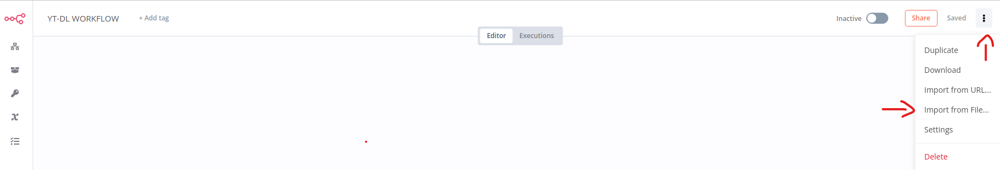

#### Configurer les crédentials

Pour faire fonctionner l'application, vous aurez besoin de créer 3 crédentials

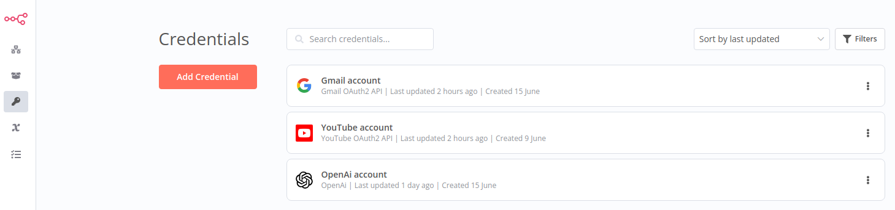

- YOUTUBE et GMAIL ACCOUNT se paramètrent sur [Google CLOUD PLATFORM](https://console.cloud.google.com/)
- OPEN AI se paramètre sur [OPEN AI](https://openai.com/)

#### Ajouter les chaines YOUTUBE

Pour modifier les chaines Youtube dont vous souhaitez avoir le résumé, il faut ouvrir chaque node GetYoutube et remplacer le Channel ID par celui de la chaine souhaitée.

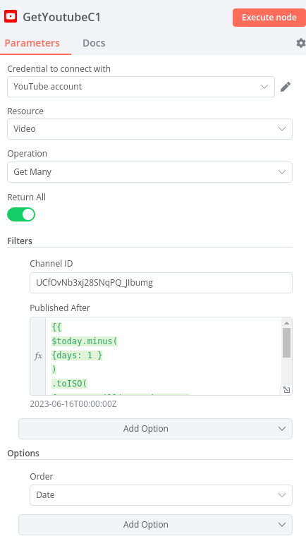

#### Modifier le template HTML

Pour modifier le template HTML avec vos données (logo, titre, lien dans footer...) vous pouvez modifier le code source du node GENERATE HTML NEWSLETTER

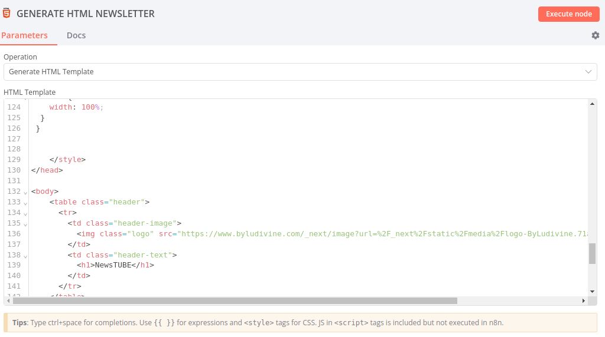

#### Configurer l'adresse email d'envoi de la newsletter

Pour recevoir la newsletter générée par email, il faut ouvir le node GMAIL et insérer votre email dans le champ : To

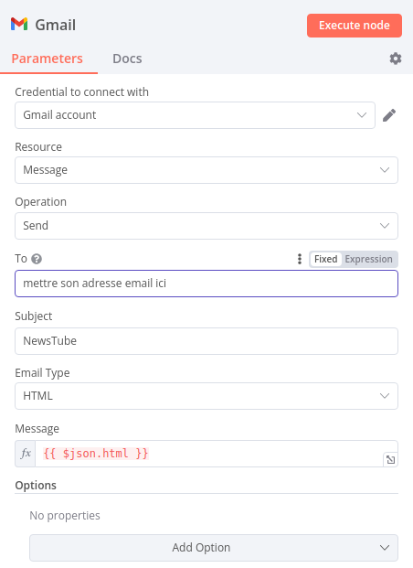

## Utilisation de l'application

- pour activer le workflow 1 fois vous pouvez cliquer sur "execute workflow"

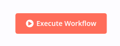

- pour déclencher le workflow automatiquement, vous devez paramétrer la fréquence dans le node Schedule Trigger

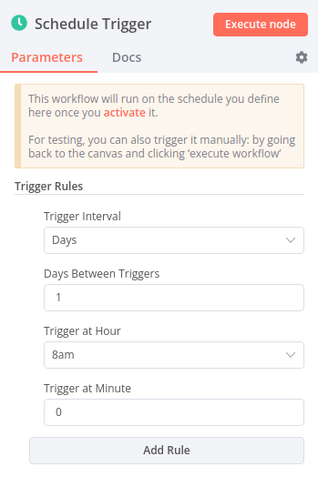

- Une fois le node Schedule Trigger paramétré, vous pouvez activer le workflow

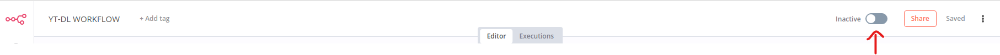

- le répertoire $HOME/youtube-dl sert de répertoire de stockage pour les fichiers audios (qui seront supprimés une fois leur conversion en txt effectuée) et également pour le fichier HTML de la newsletter (celui ci n'est pas effacé automatiquement)

## Erreur rencontrée

Lors de l'activation du Workflow, si Youtube-DL n'arrive pas à télécharger les vidéos et qu'il présente le message d'erreur ci-dessous :

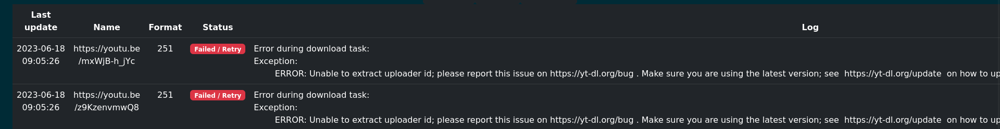

Il faut forcer la mise à jour de la dernière version de yt-dlp :

Placez-vous dans le répertoire de votre projet et entrez dans le container docker de yt-dl :

```bash
docker exec -it yt-dl sh
/usr/src/app# apk add git
/usr/src/app# pip install --upgrade --force-reinstall "git+https://github.com/ytdl-org/youtube-dl.git"
```

Le forçage de l'installation de la dernière mise à jour corrige le problème

## Newsletter générée

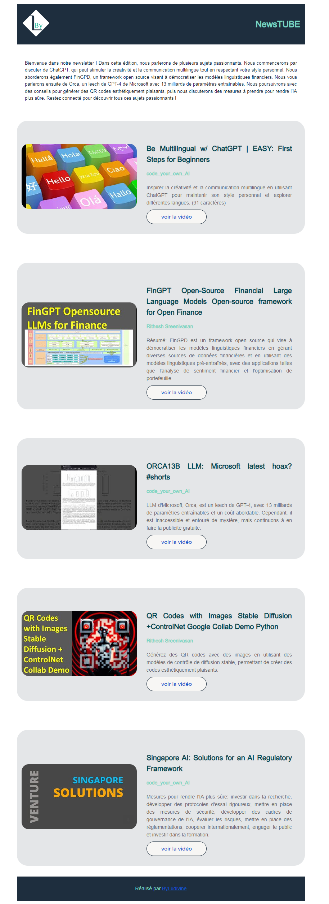

## Retour d'expérience

- Pour éviter le recours à OPEN AI, deux LLM en local ont été testés (Llampa.cpp et Vicuna). Le CPU de la machine utilisée pour l'expérimentation (CPU core i3) n'a pas permis d'exploiter ces LLM. Un hébergement spécifique avec GPU dédié pourrait permettre l'abstraction totale à OPEN AI.

- Un node d'attente a été paramétré à 30s pour laisser le temps à Youtube-dl de télécharger les vidéos. Si de nombreuses vidéos sont téléchargées, ce paramétrage doit être augmenté pour éviter la poursuite du workflow sans la totalité des vidéos.

- Le projet n'est pas adapté pour des vidéos de plus de 30mn. En effet, celles-ci génèrent un nombre de caractères supérieur à ce que peux traiter OPEN AI GPT3.5 (4k tokens). Le chunck des fichiers textes n'est pas géré au sein de cette expérimentation.

- N8N est plein de subtilités pour le traitement des process et l'utilisation des nodes. Bien que ce soit un outil nocode, des compétences en développement sont souvent nécessaires.

## Licence

Ce projet hérite de la licence de N8N qui est la plus restricitve.

Vous ne pouvez utiliser ou modifier le logiciel qu'à des fins professionnelles internes ou à des fins non commerciales ou personnelles. Vous ne pouvez distribuer le logiciel ou le fournir à des tiers que si vous le faites gratuitement à des fins non commerciales. Vous ne pouvez pas modifier, supprimer ou masquer toute licence, copyright ou autres avis du concédant de licence dans le logiciel. Toute utilisation des marques du donneur de licence est soumise à la loi applicable.
